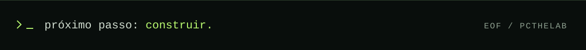

<!-- PCTHELAB / SOURCE SIDE — identidade visual em SVG local. -->
<picture>
  <source media="(max-width: 600px)" srcset="assets/header-mobile.svg">
  
</picture>

<p align="center">
  <a href="https://juan-workspace.pages.dev">portfólio</a> &nbsp;/&nbsp;
  <a href="https://www.linkedin.com/in/pcthelab">linkedin</a> &nbsp;/&nbsp;
  <a href="mailto:contato.juandev@hotmail.com">e-mail</a>
</p>

## `01` / por trás da interface

Sou **Juan Ygor Delgado**, estudante de **Análise e Desenvolvimento de Sistemas na Fatec** e desenvolvedor com foco em **backend**. Gosto de trabalhar onde uma ação vira regra, uma regra vira código e o código precisa fazer sentido.

Antes das APIs, vieram os problemas de operação: na **Cortag**, criei automações em Excel para endereçamento e roteirização de materiais. Hoje, levo essa experiência para projetos com **Java / Spring Boot**, conectando regras de negócio, dados e interfaces.

`Mogi Guaçu, SP` &nbsp; `ADS · conclusão prevista em jun/2028`

## `02` / código em evidência

### [OmniCash ↗](https://github.com/Pcthelab/OmniCash)

**Finanças pessoais, da autenticação ao último lançamento.**

Aplicação full stack com API REST, autenticação JWT e dados isolados por usuário. Dashboard, filtros e exportação CSV conectam a regra de negócio à experiência de quem usa.

`Java 21` `Spring Boot` `Spring Security` `React` `PostgreSQL`

[Explorar o código](https://github.com/Pcthelab/OmniCash) · [Abrir a aplicação](https://omnicash.netlify.app)

---

### [CashFlowProject ↗](https://github.com/Pcthelab/CashFlowProject)

**A regra de negócio também mora do lado do servidor.**

Gestão financeira com API em .NET e interface em React/TypeScript. Lançamentos vinculados a pessoas, validações na API e relatórios consolidados — incluindo a regra de que menores de idade só podem registrar despesas.

`C#` `.NET 10` `Entity Framework Core` `React` `TypeScript`

[Explorar o código](https://github.com/Pcthelab/CashFlowProject)

---

### [Campo Minado ↗](https://github.com/Pcthelab/Campo-minado-web)

**Um clique na interface. Uma cadeia de decisões por baixo.**

Começou em Java Swing e ganhou uma interface web. O Java mantém as regras e o estado da partida; o navegador envia jogadas pela API. Primeiro clique seguro, abertura em cascata e testes do modelo e da integração HTTP.

`Java` `HTTP / JSON` `HTML` `CSS` `JavaScript`

[Explorar o código](https://github.com/Pcthelab/Campo-minado-web)

## `03` / ferramentas de trabalho

```text
backend   → Java · Spring Boot
dados     → PostgreSQL · SQL Server · JPA
interface → React · TypeScript · JavaScript
qualidade → JUnit 5 · Postman
ambiente  → Git · Maven · Docker · Docker Compose
contato em projeto → C# · .NET · EF Core
```

<details>
<summary><code>cat formation.log</code> — formação, cursos e contexto</summary>

<br>

- **Fatec** — Análise e Desenvolvimento de Sistemas. Conclusão prevista: junho de 2028.
- **Itaú / DIO** — Java com Inteligência Artificial, 45h · agosto de 2026. [Certificado](https://hermes.dio.me/certificates/EAAHIAZQ.pdf).
- **Udemy** — Java COMPLETO: Do Zero ao Profissional, 77h · agosto de 2026. [Certificado](https://www.udemy.com/certificate/UC-f14575d2-88d9-4a2b-b11e-4b909d5bb307/).
- **SCRUMstudy** — Scrum Fundamentals Certified · agosto de 2026. [Certificação](https://www.scrumstudy.com/certification/verify?type=SFC&number=1181166).
- **Cortag · 2024–2026** — operações logísticas e exportação, automações em Excel e uso diário de ERP Datasul e WMS Stockbox.
- **Inglês intermediário** — leitura de documentação técnica e escrita em contextos de tecnologia; conversação básica a intermediária.

</details>

## `04` / próxima conexão

Busco **estágio em desenvolvimento de software ou QA**, com preferência por backend e abertura para frontend e full stack.

Tem um problema real e espaço para alguém crescer construindo? **[Vamos conversar.](mailto:contato.juandev@hotmail.com)**

[LinkedIn](https://www.linkedin.com/in/pcthelab) · [Portfólio](https://juan-workspace.pages.dev) · [contato.juandev@hotmail.com](mailto:contato.juandev@hotmail.com)

<br>


