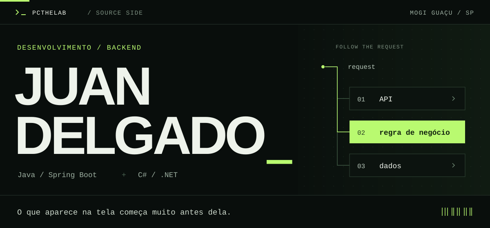
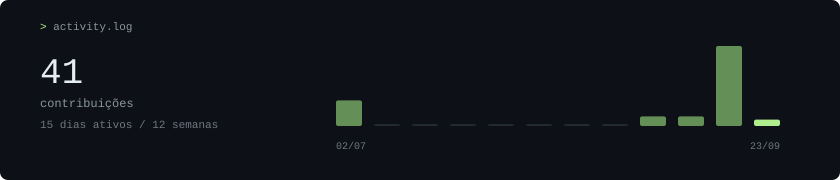

<picture>
  <source media="(max-width: 600px)" srcset="assets/header-mobile.svg">
  
</picture>

  <a href="https://juan-workspace.pages.dev">portfólio ↗</a> &nbsp; · &nbsp;
  <a href="https://www.linkedin.com/in/pcthelab">linkedin ↗</a> &nbsp; · &nbsp;
  <a href="mailto:contato.juandev@hotmail.com">contato ↗</a>

 

  <code>Java</code> &nbsp; <code>Spring Boot</code> &nbsp; <code>PostgreSQL</code> &nbsp; <code>Docker</code>
    
  <code>React</code> &nbsp; <code>TypeScript</code> &nbsp; <code>JUnit</code> &nbsp; <code>Git</code>

 

<a href="https://github.com/Pcthelab?tab=overview">
  <picture>
    <source media="(max-width: 600px)" srcset="assets/activity-mobile.svg">
    
  </picture>
</a>
