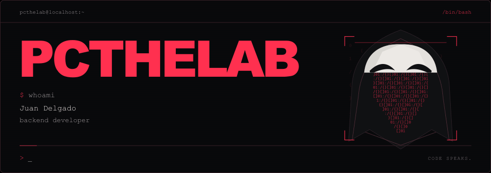

<picture>
  <source media="(max-width: 600px)" srcset="assets/hero-mask-mobile.gif">
  
</picture>

  <a href="https://juan-workspace.pages.dev"><picture><source media="(max-width: 600px)" srcset="assets/link-1-mobile.svg?v=mask"></picture></a>
  <a href="https://www.linkedin.com/in/pcthelab"><picture><source media="(max-width: 600px)" srcset="assets/link-2-mobile.svg?v=mask"></picture></a>
  <a href="mailto:contato.juandev@hotmail.com"><picture><source media="(max-width: 600px)" srcset="assets/link-3-mobile.svg?v=mask"></picture></a>

<picture>
  <source media="(max-width: 600px)" srcset="assets/stack-mobile.svg?v=mask">
  
</picture>

<a href="https://github.com/Pcthelab?tab=overview">
  <picture>
    <source media="(max-width: 600px)" srcset="assets/activity-mobile.svg?v=mask">
    
  </picture>
</a>
